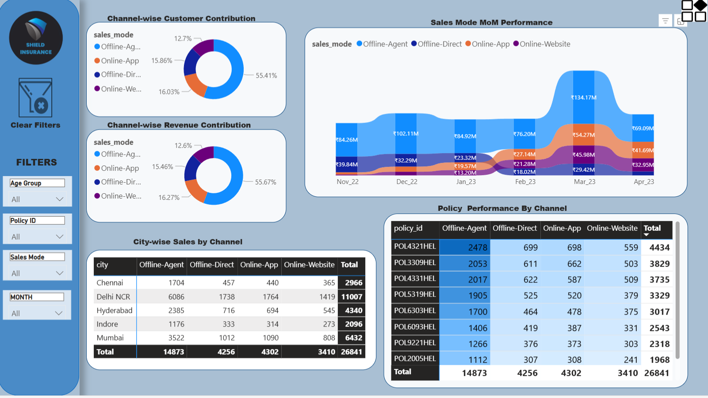
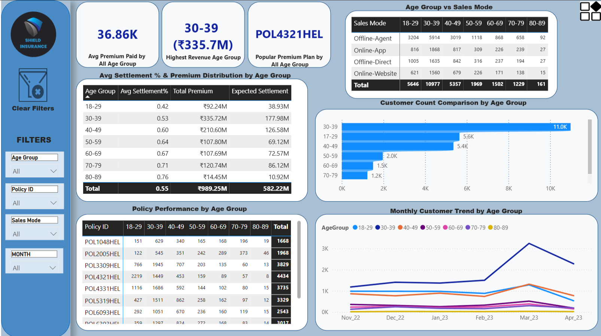

# 📊 SHIELD INSURANCE – Business Performance & Customer Insights Dashboard (Power BI)

 
 
 
  

---

## 📌 Table of Contents  
- [Project Overview](#project-overview)  
- [Tasks Performed](#tasks-performed)  
- [Key Insights](#key-insights)  
- [Data Model](#data-model)  
- [Dashboards Preview](#dashboards-preview)  
- [Tools & Technologies](#tools--technologies)  
- [Skills Demonstrated](#skills-demonstrated)  
- [Conclusion](#conclusion)  
- [Explore More](#explore-more)  
- [Connect With Me](#connect-with-me)  

---

## 🧠 Project Overview  
This project is a **Power BI case study** developed for **Shield Insurance**, focused on analyzing overall business performance, sales channels, and customer demographics.  

The objective was to design an **end-to-end BI solution** that provides clear insights into:  
- **Revenue growth and customer trends**  
- **Sales performance by mode (offline/online)**  
- **Policy contribution and profitability**  
- **Demographic-based performance and claim settlement patterns**  

This project empowers business stakeholders to make **data-driven decisions** for optimizing sales strategies and improving customer retention.  

👉 **Live Dashboard:** [Shield Insurance Power BI Dashboard](https://app.powerbi.com/view?r=eyJrIjoiZWU5Y2M5ZjAtNzM4OC00OGM4LTg2MWEtMDRlMjk3NGM3OWNiIiwidCI6ImM2ZTU0OWIzLTVmNDUtNDAzMi1hYWU5LWQ0MjQ0ZGM1YjJjNCJ9)  

---

## 🧩 Tasks Performed  

### 🔹 1. Data Preparation (Power Query)
- Cleaned and transformed raw data from **Excel sources**.  
- Handled missing values, standardized naming conventions, and ensured data consistency.  
- Added custom columns for **Month-Year**, **Policy Mapping**, and **Premium Grouping**.  

---

### 🔹 2. Data Modeling  
- Designed a **Star Schema Model** with **two Fact tables** and **three Dimension tables** for efficient analytics.  
- **Fact Tables:**
  - **fact_premiums** → contains premium transaction data (policy_id, customer_code, sales_mode, revenue, and date).  
  - **fact_settlements** → includes claim settlement details (settlement %, age, and age group).  
- **Dimension Tables:**
  - **dim_customer** → holds demographic and customer-level data (customer_code, city, DOB, Age, AgeGroup).  
  - **dim_policies** → stores policy details (policy_id, coverage, base premium).  
  - **dim_date** → a calendar table for time intelligence functions.  
- Created **Age** and **AgeGroup DAX columns** inside **fact_settlements** to establish a relationship with **dim_customer**.  
- Ensured accurate **one-to-many** relationships for seamless cross-filtering.  

📊 *Data Model Preview:*  
  

---

### 🔹 3. DAX Measures & Calculated Columns  
- Built **DAX measures** for KPIs including:  
  - `Total Revenue`, `Average Premium`, `Customer Count`, `Settlement %`, and `MoM Growth`.  
- Created **DAX calculated columns**:  
  - `Age` and `AgeGroup` in `fact_settlements` to relate to `dim_customer`.  
- Developed **Dynamic Titles** using DAX to make visuals context-aware based on user selections.  
- Optimized measure dependencies for report performance.  

---

### 🔹 4. Dashboard Design  
- Created **three interactive dashboards**:  
  - **Dashboard 1 – General Overview:** Company KPIs, revenue & customer growth summary.  
  - **Dashboard 2 – Sales Mode Analysis:** Revenue and customer contribution across different sales modes.  
  - **Dashboard 3 – Age Group Analysis:** Demographic impact on revenue, premium payments, and claim settlements.  
- Implemented **Bookmarks** and **Selection Pane** for visual transitions between revenue and customer trends.  
- Added **Home Page**, **Support Page**, and **Instruction Manual** for easy navigation and user guidance.  

---

## 💡 Key Insights  
✔️ The **30–39 age group** generated the **highest revenue (₹335M+)**.  
✔️ **Offline Agents** contributed **55%+ of total revenue**, though online channels show strong growth potential.  
✔️ **March 2023** was the highest-performing month, driven by renewal campaigns.  
✔️ **Delhi NCR and Mumbai** are the most profitable regions.  
✔️ **POL4321HEL** is the most popular plan across all demographics.  
✔️ **Seniors (60+)** have higher settlement ratios, while **young customers (18–29)** drive long-term business stability.  

---

## 🖼️ Dashboards Preview  

### Dashboard 1 – General Overview  
  

### Dashboard 2 – Sales Mode Analysis  
  

### Dashboard 3 – Age Group Analysis  
  

👉 [Try Live Interactive Dashboard](https://app.powerbi.com/view?r=eyJrIjoiZWU5Y2M5ZjAtNzM4OC00OGM4LTg2MWEtMDRlMjk3NGM3OWNiIiwidCI6ImM2ZTU0OWIzLTVmNDUtNDAzMi1hYWU5LWQ0MjQ0ZGM1YjJjNCJ9)  

---

## 🧰 Tools & Technologies  
- **Power BI Desktop** – Data Modeling, DAX, and Visualization  
- **Power Query** – ETL and data transformation  
- **Excel** – Source and validation data  
- **Power BI Service** – Publishing and sharing dashboards  

---

## 🧠 Skills Demonstrated  
- Data Cleaning & Transformation (Power Query)  
- Star Schema Data Modeling  
- DAX (Measures, Columns, and Dynamic Titles)  
- Storytelling & Dashboard Design  
- UX-focused Power BI Navigation (Bookmarks & Buttons)  

---

## 🏁 Conclusion  
This project demonstrates how **Power BI can transform raw insurance data into actionable insights** by:  
- Connecting customer demographics to business KPIs.  
- Identifying high-value sales modes and customer segments.  
- Enabling data-driven decisions to balance profitability and customer satisfaction.  

---

## 🔗 Explore More  
💼 Check out my full analytics portfolio here:  
👉 [https://codebasics.io/portfolio/Mohammad-Navaman-Jamadar](https://codebasics.io/portfolio/Mohammad-Navaman-Jamadar)  

---

## 🤝 Connect With Me  
📧 **Email:** [noumanjamadar123@gmail.com](mailto:noumanjamadar123@gmail.com)  
🔗 **LinkedIn:** [www.linkedin.com/in/mohammad-navaman-jamadar](https://www.linkedin.com/in/mohammad-navaman-jamadar)  

---
